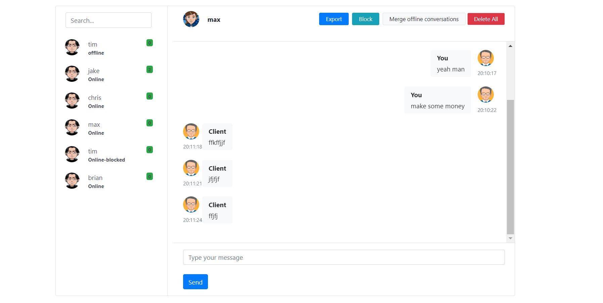
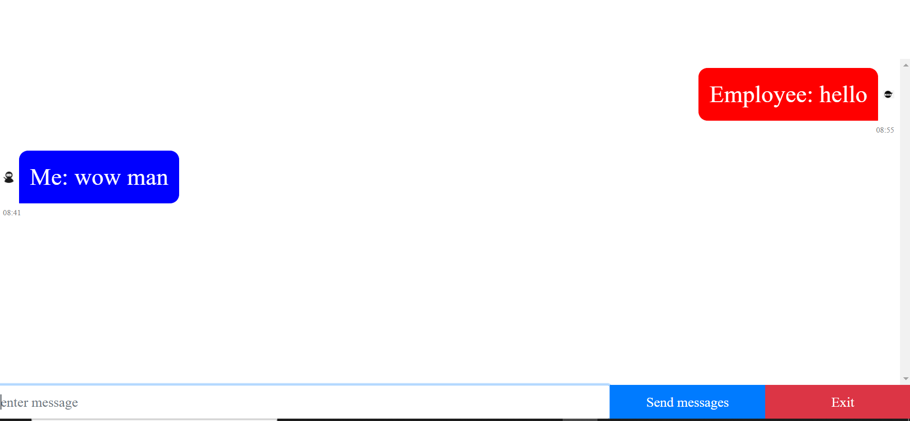

# php-dashboard-chat

Ratchet.Io(PHP) - live chat bar at the bottom of users screen and when user connects to socket, spin up an element on employee screen of user and display messages that you can respond directly to. export, delete, merge offline conversations and block annoying people... if you have a website with a lot of visitors who need to talk fast, put "client.html" on home page and put "employee.html" on back page. Then use the command "php bin/chat-server.php" to init the tcp server. once init... you must be on the "employee.html" page for any messages to come from clients. switch up the ui however you want.

<h5> dashboard </h5>

<h5>potential client</h5>

